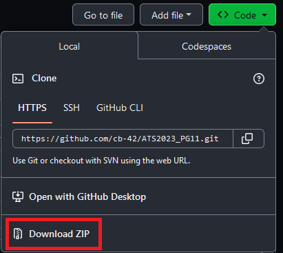

# ATS 2023 PG11: A HANDS-ON INTRODUCTION TO STUDYING THE LUNG MICROBIOME

This is a guide for acquiring the materials for **ATS 2023 PG11: A
HANDS-ON INTRODUCTION TO STUDYING THE LUNG MICROBIOME** which is based
on the [**Dickson Lab SOP for Analysis of 16S rRNA Gene Amplicon
Data**](https://github.com/cb-42/Dickson_16S_SOP). This repository
includes data and source code for a tutorial analysis of the lung
microbiome.

# Preparation & Setup

Prior to starting, several pieces of software need to be acquired.
Completing the first four steps is necessary in order to be able to
begin working with the code and data. It may take between 15-30 minutes
to complete these preparatory tasks.

## I. R

First you’ll need to download and install R (version 4.3.0). R can be
acquired directly from [CRAN](https://cran.r-project.org/), though
you’ll need to select the appropriate link for your operating system. If
R is already installed, we recommend checking the version and updating
to the current version (4.3.0) if necessary. You can check your R
version by entering `getRversion()` in the R console.

For additional information about downloading and installing R, see
section [A.1.1
(Windows)](https://rstudio-education.github.io/hopr/starting.html#windows)
or [A.1.2
(Mac)](https://rstudio-education.github.io/hopr/starting.html#mac) from
[Hands-On Programming with
R](https://rstudio-education.github.io/hopr/). Note that the R version
should be replaced with 4.3.0.

## II. RStudio

Secondly, download and install the free desktop version of RStudio. This
task is also noted as step 2 on the [RStudio Desktop download
page](https://posit.co/download/rstudio-desktop/). We recommend updating
RStudio Desktop if a prior installation exists.

## III. 16S Analysis SOP Materials

Next, the course materials need to be acquired and loaded. First, locate
the green **Code** dropdown button at the top right of this page. After
clicking this, find the **download ZIP** option on the **Local** tab.
Alternatively, navigate to
<https://github.com/cb-42/ATS2023_PG11/archive/refs/heads/main.zip> to
download the materials.

From your Downloads folder, extract the files from
**ATS2023_PG11-main.zip**. We recommend moving this unzipped/extracted
directory either to your desktop or preferred workspace. You will need
to navigate to this extracted directory in the next step.

Next, launch RStudio. After it loads, in the upper left of the RStudio
interface, create a new project by clicking **File** followed by **New
Project**. Then click on **Existing Directory** and browse to find the
**ATS2023_PG11-main** directory that was extracted.

Finally, left click the file entitled
**PG11_Lung_Microbiome_Tutorial.Rmd** from the lower right pane in the
RStudio interface. This will open the code file used throughout the
tutorial.

This extracted directory includes all of the data and code needed for
completing this walkthrough, though the only file you’ll need to
directly interact with is **PG11_Lung_Microbiome_Tutorial.Rmd**. You can
explore at your own pace, either by reviewing the code and running it
chunk by chunk, or by creating the report for a more guided experience
(see [Step
VI](https://github.com/cb-42/ATS2023_PG11#vi-knit-the-tutorial)).

## IV. Install R Packages and Dependencies

There are various ways to install the necessary R packages, but the
easiest is to simply click **Install** on the pop-up that appears after
loading the tutorial code, as shown in the following image.

After clicking install, you’ll notice activity in the **Background
Jobs** console tab on the lower portion of RStudio. If the install popup
doesn’t appear, it’s likely that the packages are already installed.

Packages can also be installed (or updated) via the **Packages** tab on
the right-hand side of the RStudio interface. Search for the package
name, then select **Install**.

## V. Introduction to R

(optional: 90-120 minutes)

It would also be highly beneficial to be familiar with the basics of R
programming prior beginning, though it is not required. A great resource
is [R for Data Science](https://r4ds.had.co.nz/). Reading chapters 1
through 5 will familiarize you with the R design philosophy and syntax
you’ll see during the hands-on presentation.

## VI. Knit the Tutorial

Finally, the .Rmd file included with these materials can be assembled
into an HTML report (by default: PG11_Lung_Microbiome_Tutorial.html) by
clicking the **Knit** button inside RStudio. This HTML report is
included in the downloadable materials, and can be viewed without
running the code, if needed.

